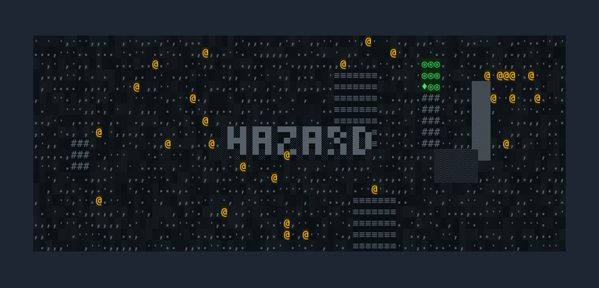
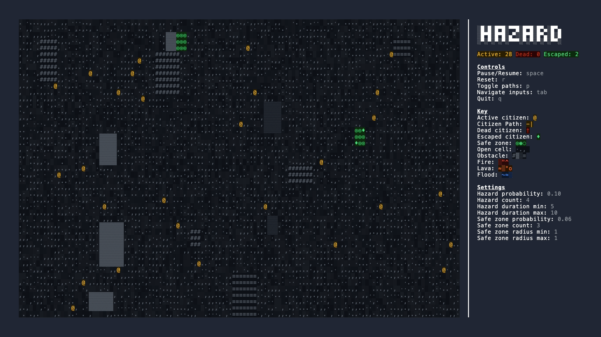
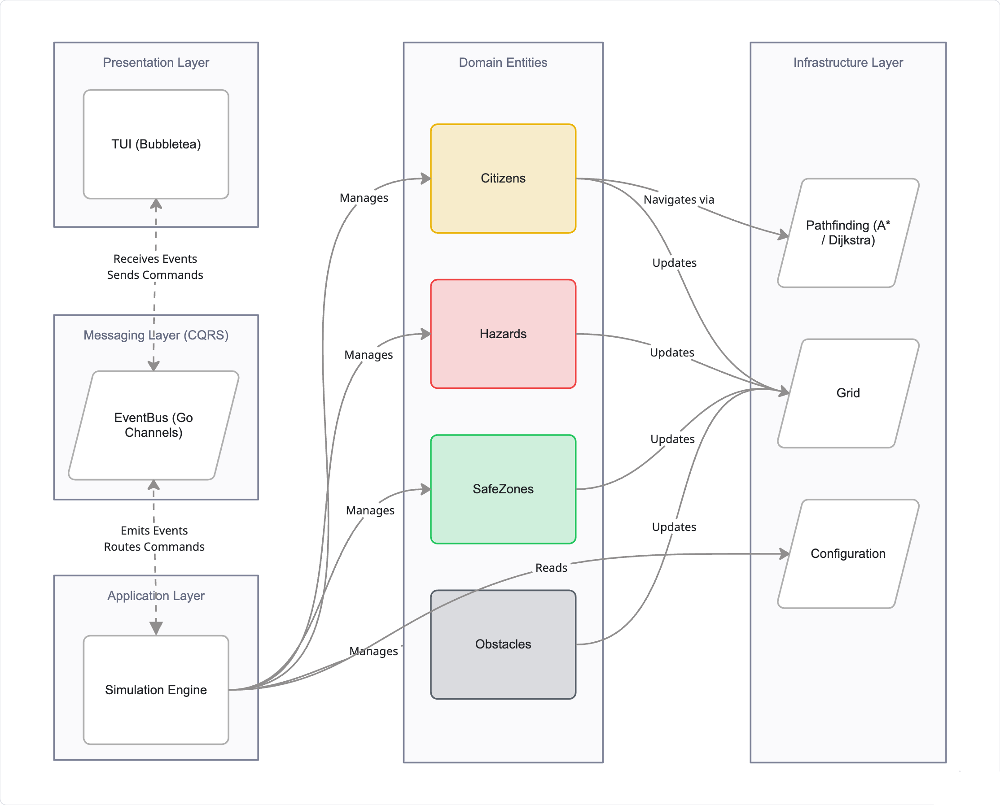
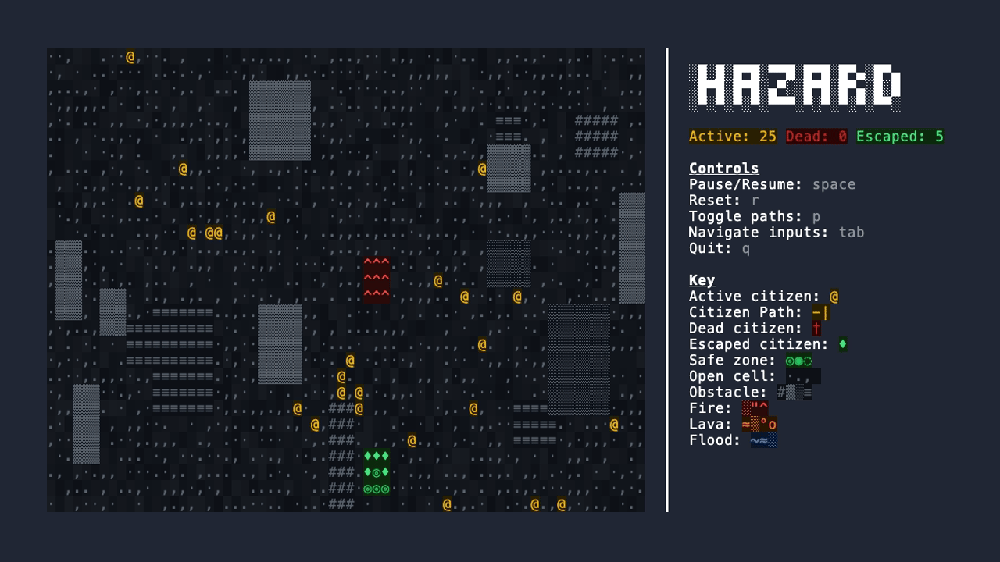
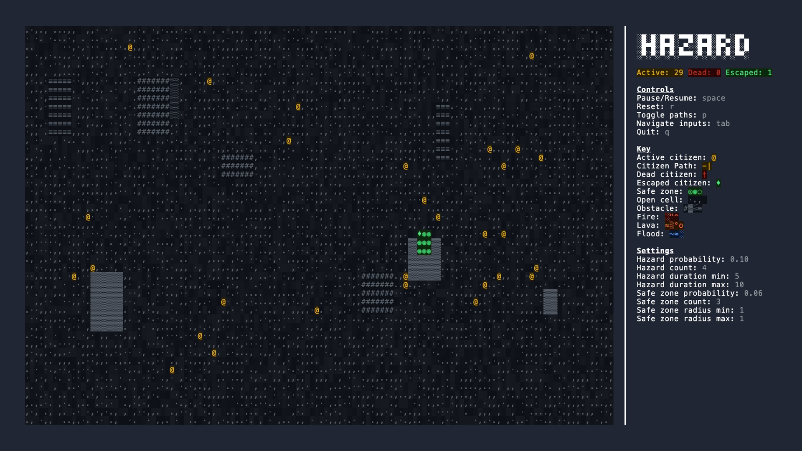
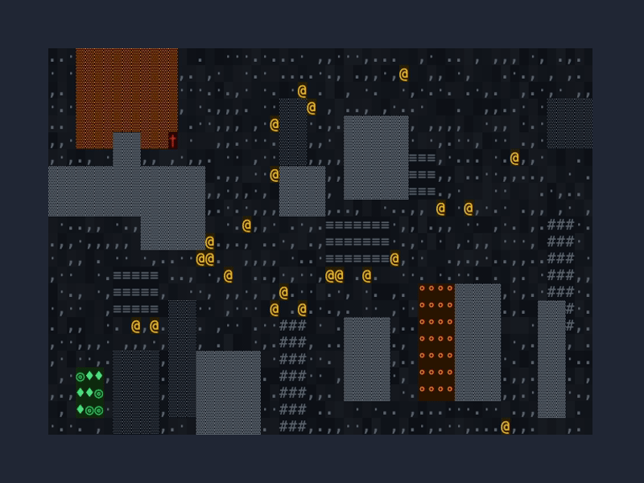

Terminal-based hazard evacuation simulation. Citizens navigate a 2D grid toward safe zones while procedurally generated hazards expand, block paths, and consume the map.

## Entities
- **Citizen:** navigates the grid, can either be escaping, escaped when it reaches a safe zone or dead when it gets caught by a hazard
  - `@` active citizen
  - `†` dead citizen
  - `♦` escaped citizen
- **Hazard:** a randomly occurring hazard that expands over a given duration. Citizens will attempt to avoid these because if they don't, they die. Hazards come in different variants such as fires, floods, and lava
  - `░"^` fire
  - `~≈░`flood
  - `≈▒°o` lava
- **Safe zone:** are safe places protected from hazards and the objective for citizens to reach. They have limited spaces, so once fully occupied, citizens need to wait for another one to appear
  - `◎◉◌` safe zone
- **Obstacle:** are static objects like buildings that occupy the grid. They're impassable, so citizens still need to avoid them when making their way to a safe zone
  - `#▓▒≡` obstacles



## Architecture

A simulation engine runs the tick loop and orchestrates the behaviour between the grid and different entities. These actions generate events via an event bus, which in turn are subscribed to by the TUI and rendered accordingly. The TUI has inputs which produce commands which are communicated to the simulation engine via the event bus.



### Tick loop

Each tick expands active hazards, spawns new hazards and safe zones probabilistically, checks citizen escape/death conditions, and advances each citizen along its path.

Citizens recalculate when their next cell is blocked, scanning only the immediate next cell rather than the full remaining path, avoiding unnecessary A* invocations.



## Pathfinding
Two pathfinding algorithms are adopted as part of citizen navigation:
- **Dijkstra (uniform-cost search)** - is used to find the nearest safe zone — the goal is a predicate matching any safe zone cell with capacity remaining.
- **A\* with Manhattan heuristic** - once an available safe zone is identified, A* is used to determine the path a citizen follows to their nearest safe zone.

 Both treat obstacles, hazards, and other citizens as blocked cells and search cardinal neighbours via a priority queue. When no valid path exists, the citizen random walks until a route opens or a hazard overtakes them.



> Tip: citizen paths can be displayed in the TUI by pressing `p`

## TUI
The terminal UI is built using the Charm ecosystem. [Bubbletea](https://github.com/charmbracelet/bubbletea) is used for TUI model, view, and update handling (Elm architecture), [Lipgloss](https://github.com/charmbracelet/lipgloss) for terminal styles, and [Bubbles](https://github.com/charmbracelet/bubbles) for terminal components.

**Progressive enhancement:** The TUI employs progressive enhancement depending on terminal viewport size. For small viewport widths, only the grid is displayed. However, for wider viewports, a sidebar is displayed to provide contextual information and system inputs. Similarly, for longer viewports, sidebar sections are progressively displayed in priority.



**Controls:**

| Key | Action |
|---|---|
| Enter / Space | Pause / resume |
| Tab / Shift+Tab / arrow keys | Cycle sidebar focus |
| p | Toggle path overlay |
| r | Reset simulation |
| q / Esc | Quit |

## Development

### Prerequisites

- [Go](https://go.dev/dl/) 1.26.4
- [golangci-lint](https://golangci-lint.run/) v2.12.2 (for linting)
- [pre-commit](https://pre-commit.com/) (for git hooks)
- [VHS](https://github.com/charmbracelet/vhs) (for creating demo recordings)

### Commands
**Run**
```bash
go run .
```

**Build**
```bash
go build -o hazard .
./hazard
```

**Test**
```sh
go test ./...
```